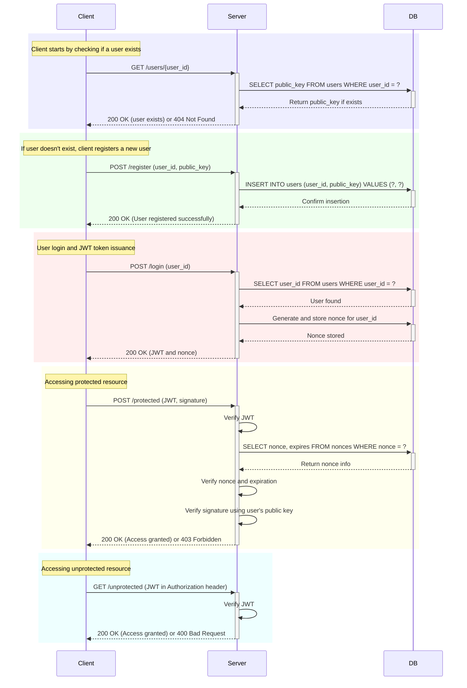

**Design a secure login and token verification mechanism for a FastAPI backend using PGP or a similar key exchange mechanism to sign JWT tokens, ensuring that only a specific user can use a given token.**

___

**Summary:** In the FastAPI application, secure user authentication is achieved through RSA key pairs and JWTs. Upon registration, a user's RSA public key is stored in our database. For login, a unique nonce and a JWT containing this nonce and user information are generated, signed with a secret key. Accessing protected endpoints requires users to submit this JWT along with a digital signature, which is verified using the user's stored public key to confirm identity and ensure message integrity.

The system involves several key cryptographic operations for authentication and secure communication. Here's a breakdown of each operation, including relevant mathematical symbols used in cryptographic theory.

#### 1. RSA Key Generation
When a new user is registered, an RSA key pair is generated. RSA is an asymmetric cryptographic algorithm used for secure data transmission.

- **Key Generation**: 
  $$$
  (e, d, n) \leftarrow RSAKeyGen(bitsize)
  $$$
  - $e$ is the public exponent (usually 65537).
  - $d$ is the private exponent.
  - $n$ is the modulus, the product of two large prime numbers $p$ and $q$.

The user's public key $K_{pub} = (e, n)$ is stored in the database, while the private key $K_{priv} = (d, n)$ is kept securely by the user.

#### 2. User Registration
Upon registration, the user's public key and user ID are stored in the database.

- **Database Operation**:
  $$$
  INSERT INTO_{users} (userid, publickey) VALUES (?, ?)
  $$$

#### 3. Login and Nonce Generation
During login, a nonce—a unique, random string used to ensure freshness of the request—is generated.

- **Nonce Generation**:
  $$$
  nonce \leftarrow SecureRandomString(16)
  $$$

The nonce, along with its expiration time, is associated with the user and stored in the database.

- **JWT Generation**:
  $$$
  JWT = Encode(payload, SECRET\_KEY, algorithm)
  $$$
  - `payload` includes the user ID, the expiration time, and the nonce.
  - The JWT is signed using the HMAC with SHA-256 algorithm, where `SECRET_KEY` is the key.

#### 4. Accessing Protected Resources
When accessing protected resources, the user must provide a JWT and a digital signature proving possession of their private key.

- **JWT Verification**:
  $$$
  \text{Verify}(JWT, SECRET\_KEY, algorithm)
  $$$

- **Signature Verification**:
  - The user creates a signature using their private RSA key on a message that concatenates the nonce and the JWT.
  $$$
  signature \leftarrow RSASign(K_{priv}, \text{hash}(nonce || JWT))
  $$$
  - The server verifies the signature using the user's public key.
  
  $$$
  RSASignVerify(K_{pub}, \text{hash}(nonce || JWT), signature)
  $$$

#### 5. Cryptographic Methods
- **Digital Signature**:
  - $M$ = message to be signed (nonce concatenated with JWT).
  - The signature involves padding and hashing the message:
    $$$
    \sigma \leftarrow K_{priv}(Hash(M))
    $$$
  - Verification:
    $$$
    K_{pub}(\sigma) \stackrel{?}{=} Hash(M)
    $$$

- **Hash Function**:
  - SHA-256 is used for hashing:
    $$$
    hash \leftarrow SHA256(message)
    $$$

- **Base64 Encoding**:
  - Signatures are base64-encoded for transmission.
    $$$
    encoded\_signature \leftarrow Base64Encode(signature)
    $$$

This detailed cryptographic write-up explains how encryption, hashing, and digital signatures are implemented to ensure secure user authentication and data integrity in the system.
